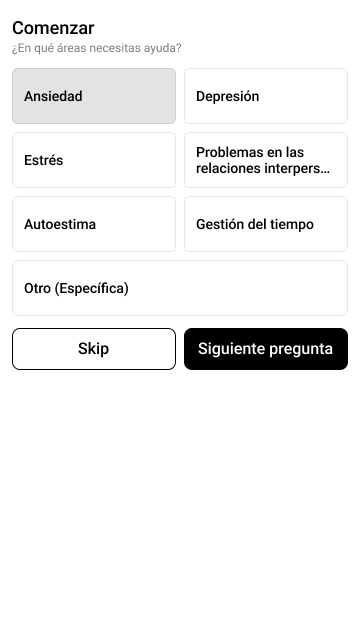
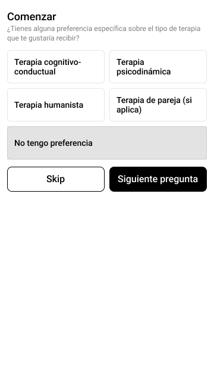
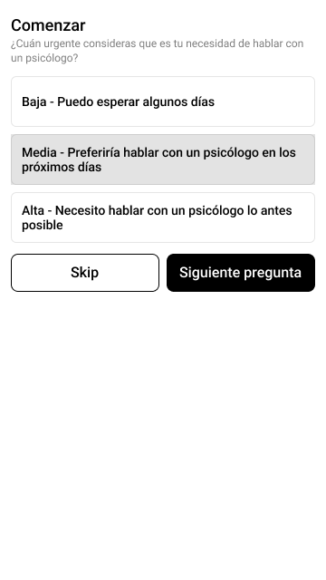
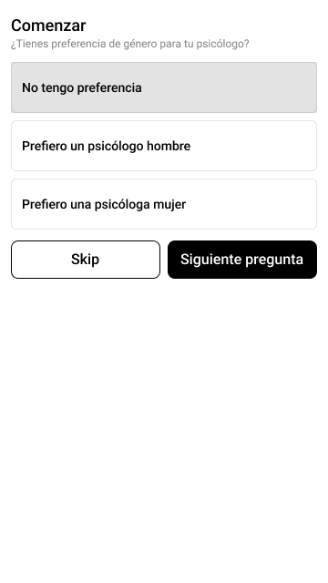
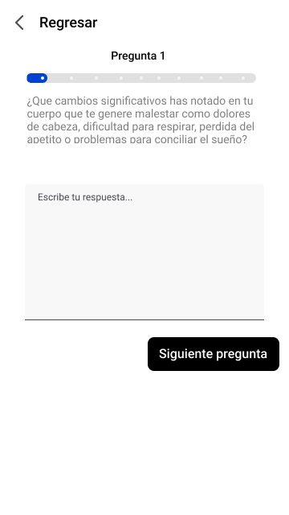
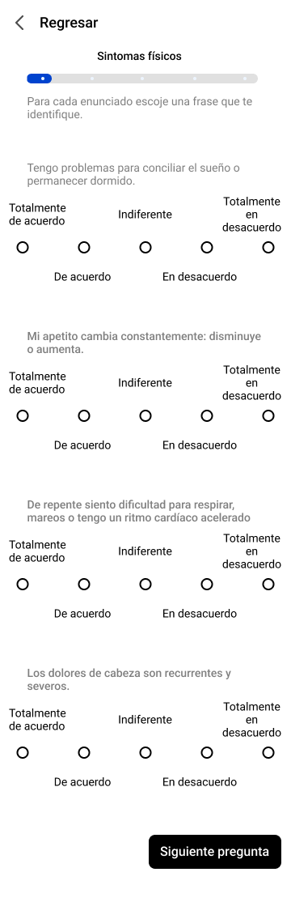

# Prueba de usabilidad 

## Propósito de las pruebas 

Validar que las preguntas que se realizan en la primera interacción con el usuario sean comprensibles, suficientes y los usuarios se sientan cómodos proporcionando su información. 

## Generación de las preguntas 

Para redactar las preguntas se tomaron como entrada el análisis de la segunda encuesta y la entrevista al Psicólogo Luis Alexander Torres Segura. 

Primero se distinguieron los elementos de preferencia que el usuario elige previo a la búsqueda de un psicólogo, así que intentamos ayudar al usuario para generar sugerencia sobre que profesionales pudieran atenderlo según el perfil que tiene el usuario como paciente.

Para validar primero que la información obtenida de las preguntas fuera útil, se consultó con el Piscólogo Alexander si pudieran extenderse para incluir otras que pudieran recabar más información para que fuera útil también para el psicologo con quien en el usuario agende su primera cita.

De esta manera utilizamos como guía las siguientes preguntas que tomamos de la página [Alcea psicología](https://alceapsicologia.com/blog/necesito-psicologo-test/).

Nuevamente, consultando con el Psicólogo Alexander, nos sugirió que las preguntas correspondientes a las secciones de sintomatología física, cognitiva, emocional y social las convirtieramos en preguntas abiertas con el objetivo de que el paciente proporcionara mayor información sobre sus sintomas en lugar de acotarlo a un número limitado de preguntas.

Con ese objetivo generamos una segunda versión de cuestionario inicial en donde pusimos dos opciones de preguntas: abiertas y de opción múltiple para consultar.

Se generaron entre 1 y 2 preguntas abiertas por sección de sintomatología con la intención de generalizar los enunciados para que los usuarios proporcionen información comparable a las preguntas de opción múltiple.

## Encuesta para la prueba de Usabilidad

Se genero una [encuesta](https://forms.gle/VMQWYhNNbELDKFh86) para recabar la información sobre la preferencia de los usuario entre contestar preguntas abiertas y de opción múltiple.

La encuesta se dividió en 4 secciones:

- Preferencia por tipo de pregunta: Se le pregunta al usuario que tipo de pregunta prefiere contestar bajo un cierto contexto y la explicación de su preferencia.
- Preguntas de opción multiple: Se le presenta las 5 secciones de preguntas de opción multiple y para cada sección se le pide al usuario que indique la cantidad de preguntas que contestaria y si considería preguntar más preguntas.
- Preguntas abiertas: Se le presenta las 7 preguntas abiertas y se le pide al usuario que indique con que nivel de detalle respondería la pregunta.
- Conclusiones finales: Se le pide al usuario vuelva a indicar su preferencia del tipo de preguntas conociendo las opciones reales y también se le pide una sugerencia final sobre las pregutnas presentadas.

La primera sección sirve para dirigir el orden de las secciones, de esta manera, primero se le presenta las preguntas de opción múltiple si el usuario escoge al principio que prefiere ese tipo de preguntas y viceversa si el usuario escoge las preguntas abiertas.

## Resultados

Se obtuvo que en la primera sección, el 93% de los encuestados escogieron que prefieren las preguntas de opción múltiple y en comparación con la última sección el porcentaje bajó a un 80%.

En la sección de opción múltiple, el 85% de los usuarios contestó que contestaría todas la preguntas para la sección de sintomatología física, emocional y social; el 70% contestaría todas las preguntas de la sección de sintomatología cognitiva; y el 92% constestaría todas las preguntas de la sección de otros sintomas.

En la sección de preguntas abiertas, el 43% de los usuarios contestaría con poco nivel de detalle las preguntas [1](./images/Cuestionario.png), [2](./images/Cuestionario-6.png), [3](./images/Cuestionario-7.png) y [5](./images/Cuestionario-9.png); el 57% contestaría con poco nivel de detalle la pregunta [4](./images/Cuestionario-8.png); el 64% constestaría con poco detalle las preguntas [6](./images/Cuestionario-10.png) y [7](./images/Cuestionario-11.png)

## Conclusiones

Como un porcentaje alto de usuarios no prefiere contestar preguntas abiertas, pudieramos considerar dejar las preguntas de opción múltiple a pesar de generar poca información valiosa para el psicólogo y solo utilizarlo para intentar sugerir los psicólogos que pudieran relacionarse con su perfil.

Otro motivo para descartar las preguntas abiertas, es que al rededor de la mitad de los usuarios respondería las preguntas con poco nivel de detalle.

Entre las sugerencias proporcionas por los usuarios esta el agregar secciones opcionales para dejar comentarios extra y aumentar la explicación de las preguntas de opción múltiple.